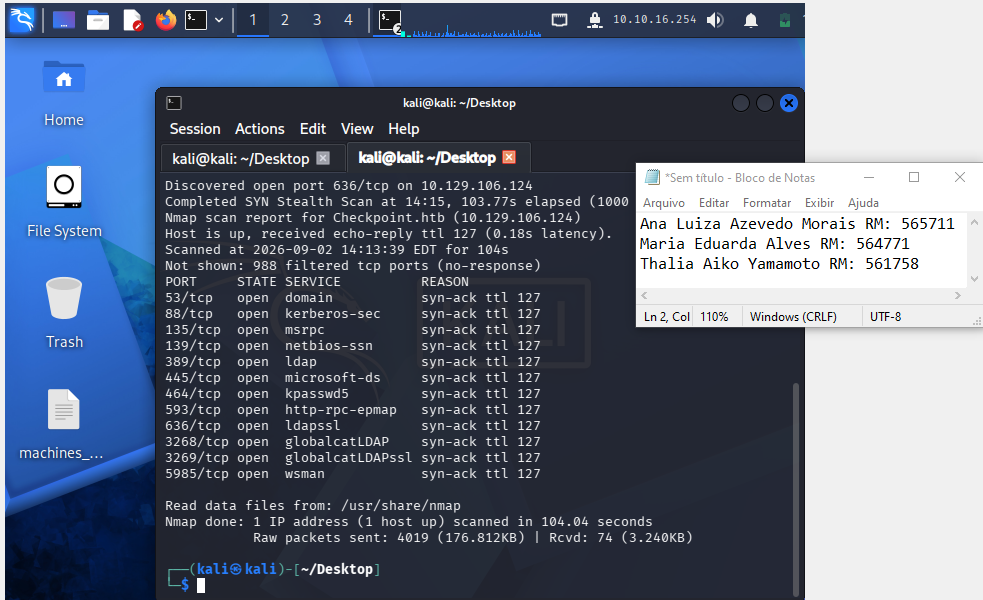

# CP 1 - Offensive - HTB

---

- **Integrantes:**
    - Ana Luiza Azevedo Morais
        - **RM:** 565771
    - Maria Eduarda Viana
        - **RM:** 564771
    - Thalia Aiko
        - RM: 561758

---

### Início - Reconhecimento Inicial

→ Após iniciar a vpn, e arrumar o /etc/hosts, começamos com um nmap: 

- **Comando executado:**

```jsx
 nmap 10.129.106.124 -vvv
```



**Explicação:**

A varredura realizada com o Nmap identificou o host **Checkpoint.htb (10.129.106.124)** como ativo, apresentando 12 portas TCP abertas. Entre os serviços identificados estão DNS (53), Kerberos (88), LDAP (389), SMB (445), LDAPS (636), Global Catalog (3268/3269) e WinRM (5985).

A combinação desses serviços indica características de um ambiente **Windows Server com Active Directory**, sendo provável que o host desempenhe a função de **Controlador de Domínio (Domain Controller)**. Os resultados obtidos fornecem informações relevantes sobre a infraestrutura e servem como base para etapas posteriores de enumeração e análise de segurança.

---

### Descobrindo o nome do Domínio do IP alvo

- **Comando executado:**

```jsx
 nmap 10.129.106.124 -vvv -sV
```


**Explicação**: 

A varredura realizada pelo Nmap identificou o host **DC01,** com o nome de dominio **checkpoint.htb**, com sistema operacional **Windows**, associado ao domínio **checkpoint.htb,** também foram identificados serviços como DNS, Kerberos, RPC, NetBIOS, SMB e LDAP, incluindo o Active Directory LDAP e o Global Catalog.

A presença desses serviços confirma um ambiente **Windows Active Directory**, indicando que é um Domain Controller, também indentificamos versões e serviços disponíveis que são informações relevantes para a compreensão da infraestrutura e para futuras explorações.

---

### Conferindo se o SMB está aceitando conexão do usuário “guest” (sem senha)

- **Comandos utilizados e executados:**

→ Vamos descobrir se o guest pode ser autenticado sem senha:

```jsx
netexec smb checkpoint.htb -u guest -p ""
```

→ Após o erro, foi utilizado um comando um pouco mais específico e direto, para garantir que a informação estava correta:

```jsx
smbclient -L //10.129.106.124 -U 'guest%'
```


**Explicação**: 

Foi realizada uma tentativa de autenticação no serviço SMB utilizando a conta **Guest** com senha vazia, o servidor retornou **NETBIOS timeout**, para conferir foi usado outro comando semelhante e o servidor retornou o código **NT_STATUS_ACCOUNT_DISABLED**, indicando que a conta Guest encontra-se desabilitada no sistema. Dessa forma, não foi possível realizar autenticação ou enumerar os compartilhamentos SMB utilizando essa conta.

---

### Login com a credencial correta

- **Comando executado:**

```jsx
netexec smb checkpoint.htb -u alex.turner -p 'Checkpoint2024!'
```


**Explicação**: 

Podemos obter o acesso com as credenciais fornecidas, agora será possível realizar a exploração de forma mais eficaz.

---

### Listagem de pastas compartilhadas

- **Comando executado:**

```jsx
netexec smb checkpoint.htb -u alex.turner -p 'Checkpoint2024!' --shares
```


Aqui podemos diversos diretórios, agora nós temos mais informações para explorar e identificar.

---

### Exploração de diretórios

- **Comandos executados:**

→ Tentamos entrar na pasta ADMIN$ → Acesso negado.

```jsx
smbclient //checkpoint.htb/ADMIN$ -U "alex.turner"
```

---

→ Tentamos entrar na pasta C$ → Acesso negado.

```jsx
smbclient //checkpoint.htb/C$ -U "alex.turner"
```


---

→ Tentamos entrar na pasta DevDrop → conseguimos entrar, não possui nenhum arquivo.

```jsx
smbclient //checkpoint.htb/DevDrop -U "alex.turner"
```


---

→ Tentamos entrar na pasta IPC$ → conseguimos entrar, não possui nenhum arquivo para listagem.

```jsx
smbclient //checkpoint.htb/IPC$ -U "alex.turner"
```


---

→ Tentamos entrar na pasta VMBackups → conseguimos entrar, porém, nossa conta não possui permissão para executar comando.

```jsx
smbclient //checkpoint.htb/VMBackups -U "alex.turner"
```


---

→ Tentamos entrar na pasta NETLOGON → conseguimos entrar, mas não temos permissão para executar comandos.

```jsx
smbclient //10.129.106.124/VMBackups -U "alex.turner"
```


---

→ Por último, olhamos a pasta SYSVOL → trouxe algo importante, tem algumas pastas dentro dela, a principal é a de profile, ela nos trás informações das configurações das duas GPOs.

```jsx
smbclient //10.129.112.77/SYSVOL -U "alex.turner"
```

→ Primeiro, vemos que possui um diretório na pasta: 


→ Para facilitar a exploração usamos o seguinte **comando**: 

```jsx
recurse on
ls
```

→ Ele nos mostrou que muitas pastas estavam vazias, facilitando e economizando tempo, então fomos analisar a pasta profile, pois dentro dela contém um arquivo que pode ser importante:


**→ Esse é o conteúdo do primeiro arquivo da primeira GPO:** 


**→ Esse é o conteúdo da segunda GPO:** 


**Explicação**:

Enquanto exploravamos o **SYSVOL**, encontramos dois arquivos **GptTmpl.inf** associados às políticas de grupo do domínio. 

O primeiro arquivo contém configurações relacionadas principalmente à política de senhas**,** bloqueio de contas e autenticação Kerberos, no meio das configurações encontradas estão:

- comprimento mínimo de senha de 7 caracteres
- exigência de complexidade
- histórico das últimas 24 senhas
- validade máxima de 42 dias

Também foi identificado **LockoutBadCount = 0**, mostrando que não existe um limite de tentativas falhas configurado para o bloqueio da conta, além disso, o armazenamento de senhas em texto claro e de hashes LM está desabilitado.

O segundo **GptTmpl.inf** possui configurações relacionadas à proteção das comunicações e aos privilégios do sistema, dentro dele encontramos o uso obrigatório de integridade no LDAP, o arquivo também define diversos privilégios administrativos para grupos específicos.

Dessa forma percebemos que o ambiente possuimuitas medidas de segurança, principalmente na proteção de LDAP, SMB e credenciais, porem, algumas configurações, como o comprimento mínimo de senha e a ausência de um limite de bloqueio por tentativas inválidas, podem apresentar um problema, pois podem representar um problema.

---

### RPCCLIENT

→ Primeiro nos conectamos, após isso rodamos o comando para listar os usuários do domínio

- **Comandos executados:**
    - **Conectar no RPCC:**

```jsx
rpcclient -U 'checkpoint.htb\alex.turner%Checkpoint2024!' 10.129.112.77
```

- **Procurar usuários**

```jsx
enumdomusers
```


**Explicação:** 

Com esse comando é possível identificar usuários cadastrados no domínio, isso é uma informação importante porque nós podemos realizar a exploração desses usuários, quem sabe até acessar algum deles que possui um privilégio maior que o do Alex.

---

### Informações do Alex

- **Comando executado:**

```jsx
queryuser alex.turner
```


**Explicação:** 

Essas informações ajudam a entender quem é o usuário, como a conta está configurada e quais características podem ser relevantes.

---

### Grupos cadastrados no Domínio

- **Comando executado:**

```jsx
enumdomgroups
```


**Explicação:**

Essas informações permitem o conhecimento no domínio, esses grupos podem ser explorados após a etapa de reconhecimento

---

### Análise dos RIDs do grupo de Administradores

- **Comando executado:**

```jsx
querygroupmem 512
```


**Explicação**:

Como o grupo de admins possui o RID padrão 512, fomos analisa-lo, foi encontrado a conta de “administrador” e também de um usuário que corresponde a “max.palmer”

---

### Tentando ver as informações dos integrantes do grupo Admins

→ Mesmo que não seja necessário, vamos passar os RIDs **0x13ed** & **0x1f4** para decimal obtemos **5101** & **500**, vamos pesquisar por eles.

### Olhando Max Palmer

- **Comando executado:**

```jsx
queryuser 5101
```


**Explicação:** 

Por se tratar de uma conta vinculada ao grupo de administradores, pode ser que as informações de conta ajude-nos em uma exploração futura.

---

### Olhando o outro Administrador

→ O outro administrador que possui o RID 0x1f4:

- **Comando executado:**

```jsx
queryuser 5101
```


**Explicação:**

Igual a outra conta de administrador, as informações desse usuário podem ajudar em algum momento.

---